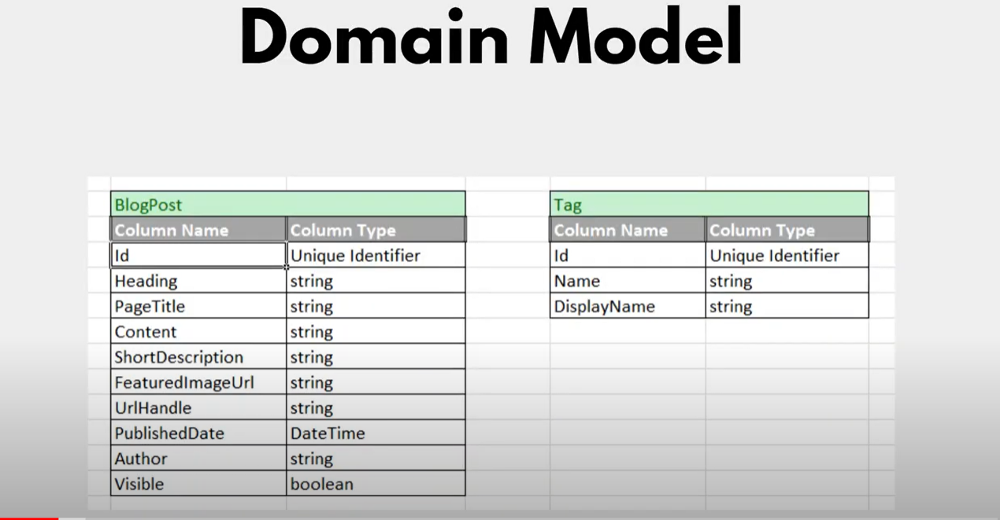
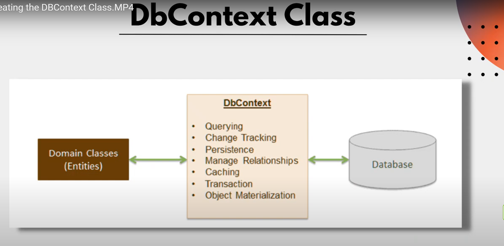
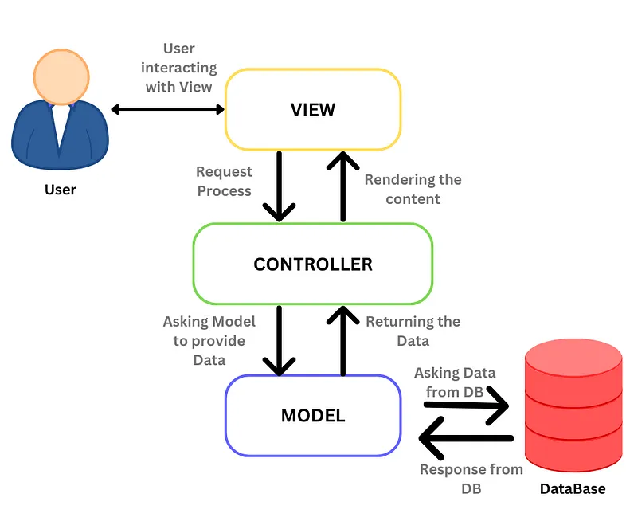

## ASP.NET MVC Complete Guide using .NET Core

### Install Package
- Microsoft.EntityFrameworkCore.SqlServer
- Microsoft.EntityFrameworkCore.Tools

### DbContext Class

- Responsible for interacting with the database
- Performing CRUD operations on our database tabls using Entity Framwork Core

### EF Core Migrations
- Requird install package Microsoft.EntityFrameworkCore.Tools
- Add-Migration "initial Migration"
- Update-Database

### ASP.NET MVC Architecture
- The MVC architectural pattern has existed for a long time in software engineering. All most all the languages
use MVC with slight variation, but conceptually it remains the same.
- MVC stands for model, view, and controller

#### Model
- Represents the data.
- A class in c# is used to describe a model. Model objects store data retrieved from the database.

#### View
- The user interface
- View Display model data to the user and also enable them to modify them. View in ASP.net MVC is HTML, CSS,
and some special syntax (Razor syntax) that makes it easy to communicate with the model and the controller.

#### Controller
- The request handler
- A user uses the view and raise an HTTP request, with will be handled by the controller. The Constroller 
process the request and return the appropriate view as a response.

### Saving Data to Database using DbContext

DbContext Class -> Entity Framwork Core -> Database

### Repository Pattern

Web Pages -> Repositories -> Database

### The Next Generation WYSIWYG HTML Editor
- https://froala.com/

### Upload Image with cloudinary
- https://cloudinary.com/

#### Corrent to do
https://drive.google.com/drive/folders/1-PzAafgbxYokmRyaGSdUgOsldokZsz0a
https://www.udemy.com/course/aspnet-mvc-course-aspnet-core/?couponCode=KEEPLEARNING